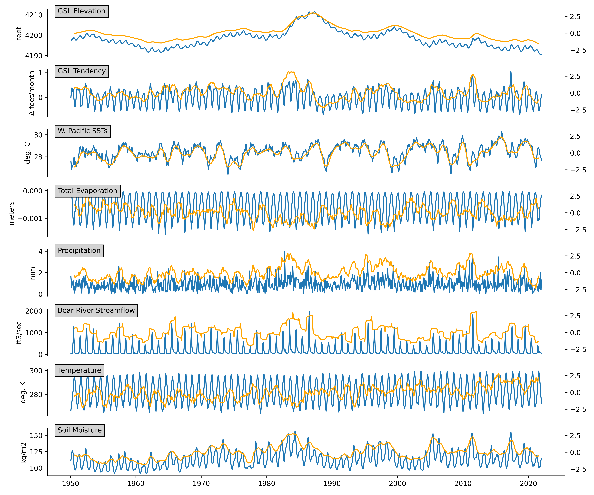

# Western US Hydroclimate extremes and Great Salt Lake decline
***

## Part 1. Observational anlaysis

## Part 2: Causal inference for future predictability

![plot2[(raw.parrcorr.month.dag.discovery.png)
